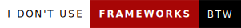

# Hi there 👋 K1EW here!

## About Me

My name is Weerawat, and I am a student at Chulalongkron University, majoring in Computer Engineering ⚙️💻.
Looking forward to learn more about theoretical computer science ⚛.

## My Interests
- 🤖 Machine learning
- 📈 Optimization algorithms
- 👾 Robotics
- 📟 Embedded systems
- 🏆 Competitive programming

    

## My Skills
#### Languages:

  

#### Tools:

  

#### Competitive Programming:

  

