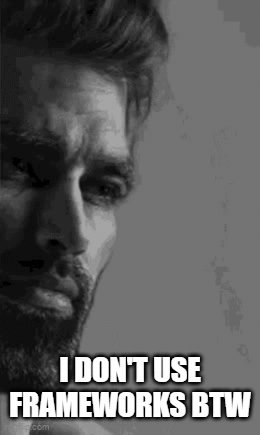

# Hi there 👋 K1EW here!

## About Me

My name is Weerawat, and I am a student at Chulalongkron University, majoring in Computer Engineering ⚙️💻.
Looking forward to learn more about theoretical computer science ⚛.

## My Interests

    <ul>
        <li>🤖 Machine learning</li>
        <li>📈 Optimization algorithms</li>
        <li>📟 Embedded systems</li>
        <li>👾 Robotics</li>
        <li>🏆 Competitive programming</li>
    </ul>
    

    

## My Skills
#### Languages:

  

#### Tools:

  

